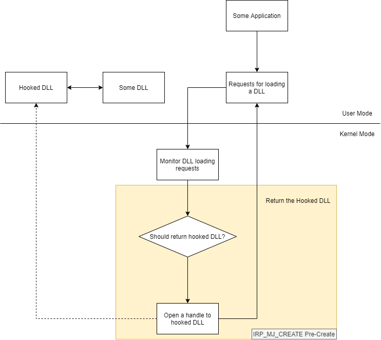

# BLUESPAWN Driver

## Capabilities

1. Monitoring and intercepting system calls
   - Software Drivers
   - File System Minifilter Drivers (AV)
2. Provides strong layer of security for the agent
3. Allow access to kernel objects

(Probably there're more things...)

## Monitoring

Using software driver:

- Process Creation - PsSetCreateProcessNotifyRoutine(Ex)
- Thread Creation (CreateRemoteThread) - PsSetCreateThreadNotifyRoutine
- DLL Loading - PsSetLoadImageNotifyRoutine
- Registry - CmRegisterCallback(Ex)
- Handles - ObRegisterCallbacks

Using File System Minifilter:

- File actions - create, open, move, delete, change, etc.
- Alternative data streams

using ETW:

- Network activity

References:

[API Data Relationships](https://docs.google.com/spreadsheets/d/1T4sm1freM4KJk9Wu8GNxDQDRPur7159kcUji9pk03xU/edit#gid=0)

## Kernel and User modes communication models

- The kernel sends activity logs to the user
- The kernel signals the user mode service to scan files (yara rules?) and prevent creation when needed (or should some scan need to be preformed in kernel mode for better performance?)

References:

[Anti-Virus Simple Scanner](https://github.com/microsoft/Windows-driver-samples/tree/master/filesys/miniFilter/scanner)

[Anti-Virus Complex Scanner](https://github.com/microsoft/Windows-driver-samples/tree/master/filesys/miniFilter/avscan)

## Event-based Kernel/User mode Communication

[Monitoring Windows Processes](https://www.apriorit.com/dev-blog/254-monitoring-windows-processes)

And why it's not good.....

[Why Sharing Events is Bad](https://community.osr.com/discussion/222534/sharing-event-from-user-to-kernel-mode-by-handle-in-wdf)

## Shadow DLL Hooking using Minifilter driver

Design:

References:

[Reparse the file (dll) to load is like be persistent in windows???](https://community.osr.com/discussion/290819/reparse-the-file-dll-to-load-is-like-be-persistent-in-windows)

[DLL Injection Driver](https://github.com/wbenny/injdrv)

## Security

- PatchGuard

References:

[Windows Driver Security Model](https://docs.microsoft.com/en-us/windows-hardware/drivers/driversecurity/windows-security-model)
